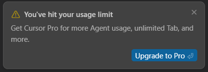
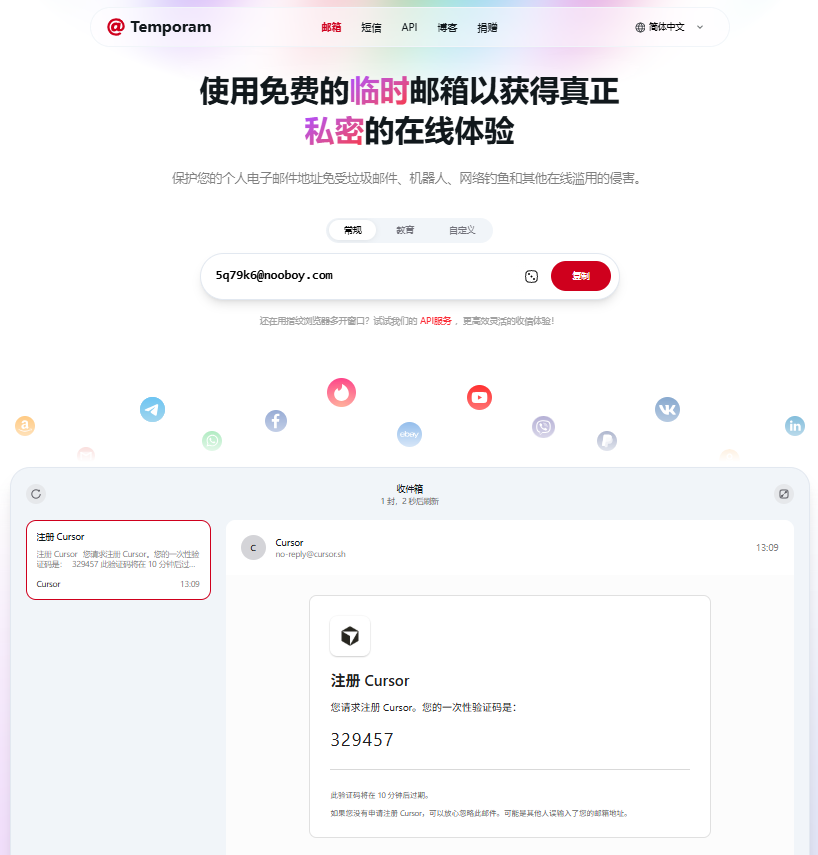

# ✨ **Cursor Free VIP 教程**

<div align="center">
  
</div>

<p align="center">
  <a href="https://github.com/yeongpin/cursor-free-vip/releases/latest">
    
  </a>
  <a href="https://creativecommons.org/licenses/by-nc-nd/4.0/">
    
  </a>
  <a href="https://github.com/yeongpin/cursor-free-vip/stargazers">
    
  </a>
  <a href="https://github.com/yeongpin/cursor-free-vip/releases/latest">
    
  </a>
  <a href="https://buymeacoffee.com/yeongpin" target="_blank">
    
  </a>
  <a href="https://deepwiki.com/yeongpin/cursor-free-vip" target="_blank">
    
  </a>
</p>

---

## 🖥️ **支持平台**

- 
- 
- 

---

## 🚀 **快速开始**

### 前提条件

- 已安装 [Cursor 客户端](https://www.cursor.com/cn)，如下图

<div align="center">
  
</div>

- 如果使用 chat 时出现以下限制，如下图
<div align="center">
  
</div>
<p align="center">或者</p>
<div align="center">
  
</div>
请先打开"文件-首选项-Cursor Settings"中点击 **log out** 退出账户，然后执行以下操作。

---

### 根据系统环境下载并运行脚本

<details open>
<summary><b>Linux / WSL / macOS 系统</b></summary>（必须已安装 git）

```bash
git clone https://github.com/oxmoei/cursor-free-vip.git && cd cursor-free-vip && chmod +x install.sh && ./install.sh
```
</details>

<details open>
<summary><b>Windows 系统</b></summary>（必须已安装 git）

> ⚠️ **请以管理员身份启动 PowerShell，依次执行以下命令：**

```powershell
Set-ExecutionPolicy Bypass -Scope CurrentUser
git clone https://github.com/oxmoei/cursor-free-vip.git
cd cursor-free-vip
.\install.ps1
```
</details>

---

### 🤖 **互动式操作步骤**

<div align="center">
  
</div>

- 1️⃣ 输入 `3`，**关闭 Cursor 应用**。
- 2️⃣ 输入 `1`，**重置机器 ID**。
- 3️⃣ 访问 [https://www.temporam.com/zh](https://www.temporam.com/zh) 复制临时邮箱（可无限刷新）

<div align="center">
  
</div>

- 4️⃣ 浏览器“无痕模式”访问官网 [https://www.cursor.com/cn](https://www.cursor.com/cn) ，使用临时邮箱进行注册。假如需要手机验证码则使用接码平台。
- 5️⃣ 打开 **Cursor** 客户端"文件-首选项-Cursor settings"，右键点击 **Sign in** 复制链接，粘贴到浏览器（无痕模式）登录。

**🎉🎉完成以上，即可重新激活 Free plan 功能。**
---

## ❓ **常见问题**

- 更多帮助请访问 [项目主页](https://github.com/oxmoei/cursor-free-vip.git) 或提交 issue。

---

> 💡 **如需进一步美化或有特殊需求，欢迎联系作者！**
